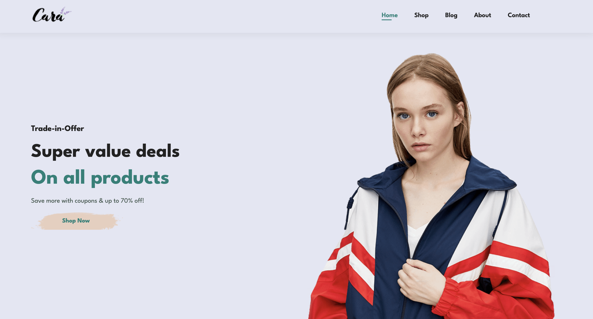

# E-Commerce Web Application

A modern, responsive e-commerce website built with HTML, CSS, and JavaScript. This project features a clean and user-friendly interface for shopping clothing and accessories.

## UI Preview



## Features

- 📱 Fully responsive design
- 🛍️ Product showcase with image galleries
- 🔍 Featured and new arrivals sections
- 🏷️ Special offers and promotional banners
- 📰 Newsletter subscription
- 📱 Mobile app installation option
- 🛒 Shopping cart functionality
- ⭐ Product rating system
- 📦 Free shipping information
- 💳 Secure payment options

## Project Structure

```
├── index.html              # Main entry point
├── style.css              # Styling definitions
├── script.js              # JavaScript functionality
└── Images/               # Image assets
    ├── about/            # About page images
    ├── banner/           # Banner images
    ├── blog/             # Blog post images
    ├── features/         # Feature icons
    ├── pay/             # Payment-related images
    ├── people/          # Team/user images
    └── products/        # Product images
```

## Getting Started

1. Clone the repository:
```bash
git clone https://github.com/Tsehla-Motjolopane-official/Dev_Web.git
```

2. Open `index.html` in your web browser to view the website.

## Technologies Used

- HTML5
- CSS3
- JavaScript
- Font Awesome 5.15.4 (for icons)

## Features Details

### Shopping Experience
- Browse through featured products
- View new arrivals
- Product details with pricing
- Star ratings for products
- Easy add-to-cart functionality

### Special Offers
- Promotional banners
- Seasonal sales
- Buy-one-get-one deals
- Special discounts up to 70% off

### Customer Support
- Newsletter subscription
- Contact information
- Social media links
- Privacy policy and terms
- Delivery information

### Mobile Experience
- Responsive design for all devices
- Mobile app download options
- Easy navigation menu
- Touch-friendly interface

## Copyright

© 2021-2025 Tech2 etc - HTML CSS Ecommerce Template

## Contributing

1. Fork the project
2. Create your feature branch (`git checkout -b feature/AmazingFeature`)
3. Commit your changes (`git commit -m 'Add some AmazingFeature'`)
4. Push to the branch (`git push origin feature/AmazingFeature`)
5. Open a Pull Request

## License

This project is licensed under standard copyright laws. All rights reserved.
